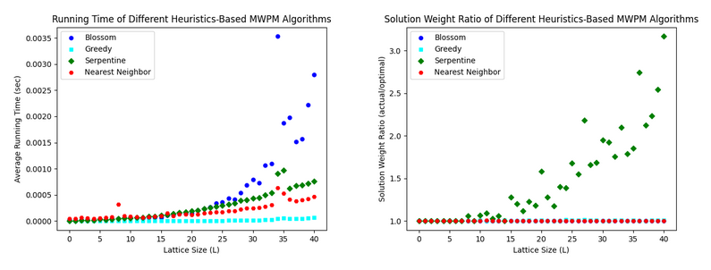
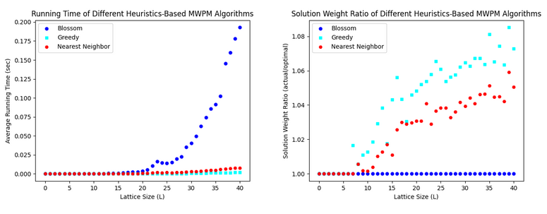

# MWPM-Heuristics-Test

$p=0.01$, uncorrelated errors

 

$p=0.05$, uncorrelated errors

## Heuristics
- [*] E. Reingold and R. Tarjan, _On a Greedy Heuristic for Complete Matching_
- M. Grigoriadis and B. Kalantari, _A New Class of Heuristic Algorithms for Weighted Perfect Matching_
- C. Imielińska and B. Kalantari, _A General Class of Heuristics for Minimum Weight Perfect Matching and Fast Special Cases with Doubly and Triply Logarithmic Errors_
- S. Hougardy and K. Tammemaa, _Fast Approximation Algorithms for Euclidean Minimum Weight Perfect Matching_
- [*] J. Bartholdi and L. Platzman, _A fast heuristic based on spacefilling curves for minimum-weight matching in the plane_
- [*] M. Iri, K. Murota, and S. Matsui, _Linear-Time Approximation Algorithms for Finding the Minimum-Weight Perfect Matching on a Plane_
- [*] K. Supowit, D. Plaisted, and E. Reingold, _Heuristics for Weighted Perfect Matching_

## Surface Codes
- Overview: https://arthurpesah.me/blog/2023-05-13-surface-code/
- H. Bombín, _An Introduction to Topological Quantum Codes_, https://arxiv.org/abs/1311.0277
- A. Fowler et al., _Surface codes: Towards practical large-scale quantum computation_, https://arxiv.org/abs/1208.0928
- E. Dennis et al., _Topological quantum memory_, https://arxiv.org/abs/quant-ph/0110143
